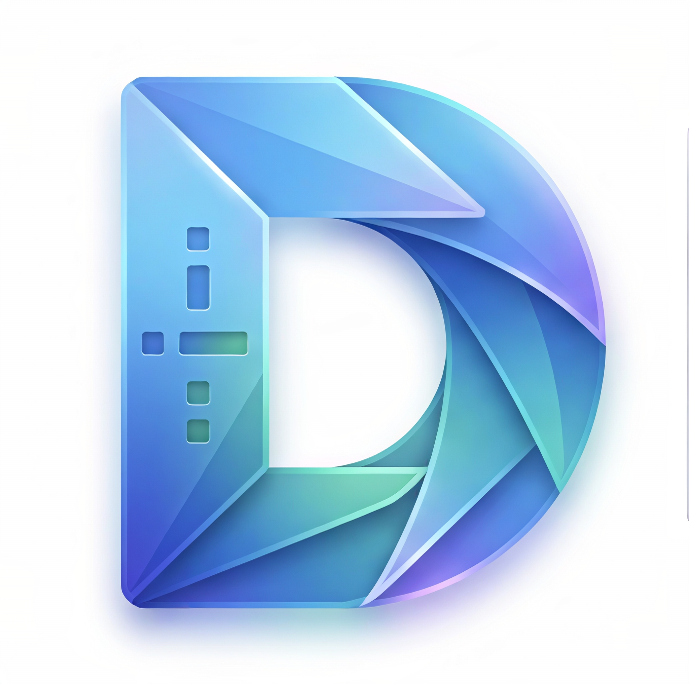

<div align="center">

  

  # DitDash

  **CLI Morse Academy • Transmissor e Decodificador em Linha de Comando**

  [](https://www.python.org/)
  [](https://www.microsoft.com/)
  [](LICENSE)

</div>

---

## Sobre

O **DitDash** é uma ferramenta de linha de comando leve voltada para a conversão bidirecional entre texto e Código Morse. O projeto foi estruturado para realizar o tratamento automático das cadeias de caracteres inseridas, tratando acentuações e padronizando o espaçamento entre palavras e letras.

---

## Funcionalidades

- **Tradução Bidirecional:**
  - **Texto ➔ Morse:** Converte palavras do alfabeto latino para sequências de pontos (`.`) e traços (`-`).
  - **Morse ➔ Texto:** Traduz sequências em Morse organizadas de volta para caracteres de texto.
- **Higienização de Dados:**
  - **Normalização de Acentos:** Remove acentuações e caracteres especiais automaticamente (por exemplo, converte `Á` em `A` e `Ç` em `C`).
  - **Padronização de Caixa:** Converte as entradas para letras maiúsculas antes do processamento.
- **Regras de Espaçamento:**
  - Separador de caracteres: Espaço simples (` `).
  - Separador de palavras: Barra (`/`).

---

## Futuras Implementações (Roadmap)

- [ ] **Sinais Sonoros:** Reprodução de áudio dos impulsos de frequência para cada ponto e traço.
- [ ] **Tabela Numérica:** Inclusão de numerais (0-9) e símbolos de pontuação no dicionário de conversão.
- [ ] **Exportação de Arquivos:** Salvamento automático das traduções em arquivos de texto `.txt`.
- [ ] **Modo de Aprendizado:** O projeto ainda não possui um módulo de treinamento. Caso haja interesse da comunidade, essa função poderá ser desenvolvida no futuro.

---

## Compilação e Build

O repositório inclui o script `build.py` para automatizar a geração do executável. O utilitário utiliza um ambiente virtual isolado para remover dependências desnecessárias do Python global e minimizar o tamanho do arquivo final.

### Requisitos

- Python 3.x instalado

---

### Execução Padrão

Para gerar o executável otimizado, execute o comando abaixo na raiz do projeto:

```bash
python build.py --isolated

### Parâmetros do Script (`build.py`)

| Parâmetro | Tipo | Valor Padrão | Descrição | Exemplo de Uso |
| :--- | :--- | :--- | :--- | :--- |
| `--isolated` | Flag | Desativado | Compila em um ambiente virtual temporário limpo para minimizar o tamanho final do executável. | `python build.py --isolated` |
| `--clean` | Flag | Desativado | Remove pastas temporárias e artefatos de compilações anteriores antes de iniciar. | `python build.py --clean` |
| `--source` | Texto | `src/DitDash.py` | Especifica o caminho para o arquivo com o código-fonte principal. | `python build.py --source src/main.py` |
| `--name` | Texto | `DitDash` | Define o nome do arquivo executável a ser gerado. | `python build.py --name DitDash_v1.0` |
| `--icon` | Texto | `assets/icon.ico` | Especifica o caminho para o arquivo de ícone (.ico). | `python build.py --icon assets/custom.ico` |
| `--arch` | Opção | Nativa do SO | Define a arquitetura alvo (`x86_64`, `x86`, `arm64`, `universal2`). | `python build.py --arch x86_64` |

'''

---

Este projeto está distribuído sob a licença MIT. Consulte o arquivo LICENSE para mais detalhes.

---

